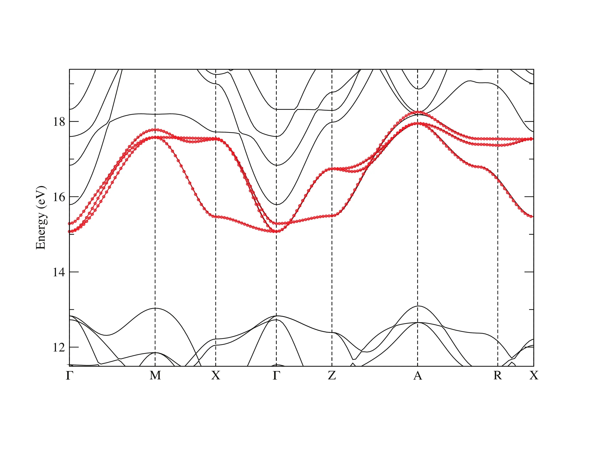

# 20: Disentanglement restricted inside spherical regions of $k$ space {#disentanglement-restricted-inside-spherical-regions-of-k-space .unnumbered}

## LaVO$_3$ {#lavo_3 .unnumbered}

-   Outline: *Obtain disentangled MLWFs for strained LaVO$_3$.*

-   Directory: `tutorial/tutorial20/` *Files can be downloaded from [here]{}*

-   Input Files

    \-    `LaVO3.scf` *The `pwscf` input file for ground
        state calculation*

    \-    `LaVO3.nscf` *The `pwscf` input file to obtain
        Bloch states on a uniform grid*

    \-    `LaV03.pw2wan` *Input file for `pw2wannier90`*

    \-    `LaVO3.win` *The `wannier90` input file*

1.  Run `pwscf` to obtain the ground state of LaVO$_3$.

    ```bash title="Terminal"
    `pw.x < LaVO3.scf > scf.out`

2.  Run `pwscf` to obtain the Bloch states on a uniform
    k-point grid.

    ```bash title="Terminal"
    pw.x < LaVO3.nscf > nscf.out
    ```

3.  Run `wannier90` to generate a list of the required overlaps (written
    into the `LaVO3.nnkp` file).

    ```bash title="Terminal"
    wannier90.x -pp LaVO3
    ```

4.  Run `pw2wannier90` to compute the overlap between Bloch states and
    the projections for the starting guess (written in the `LaVO3.mmn`
    and `LaVO3.amn` files).

    ```bash title="Terminal"
    pw2wannier90.x < LaVO3.pw2wan > pw2wan.out
    ```

5.  Run `wannier90` to compute the MLWFs.

    ```bash title="Terminal"
    wannier90.x LaVO3
    ``` 

Inspect the output file `LaVO3.wout`. In the initial summary, you will
see that the disentanglement was performed only within one sphere of
radius 0.2 arount the point $A=(0.5, 0.5, 0.5)$ in reciprocal space:

```vi title="Output file"
|  Number of spheres in k-space              :                 1             |
|   center n.   1 :     0.500   0.500   0.500,    radius   =   0.200         |
```

Compare the band structure that Wannier90 produced with the one obtained
using Quantum ESPRESSO. You should get something similar to
Fig. [9](#fig:lavo3){reference-type="ref" reference="fig:lavo3"}. Notice
how the $t_{2g}$-bands are entangled with other bands at $A$ and the
Wannier-interpolated band structure deviates from the Bloch bands only
in a small region around that $k$-point. It is important to keep in mind
that all symmetry equivalent $k$-points within the first Brillouin zone
must be written explicitly in the list of sphere centers. For instance,
the $A$ point in the simple tetragonal lattice of this example is
non-degenerate, while the $X$ point has degeneracy two, hence one must
specify both $(1/2,0,0)$ and $(0,1/2,0)$ (see the SrMnO$_3$ example here
below).

## Further ideas {#further-ideas-7 .unnumbered}

-   Try to obtain the Wannier functions using the standard
disentanglement procedure (without spheres, `dis_spheres_num = 0`).
You will notice that the Wannier-interpolated band structure now
shows deviations also in regions of $k$-space far away from $A$,
where disentanglement is actually not necessary. If you disable the
disentanglement completely, instead, the Wannierisation procedure
does not converge.

-   In order to illustrate all possible cases, it is instructive to
apply this method to SrMnO$_3$, where the $t_{2g}$ bands are
entangled with the above-lying $e_g$ bands, and also with the deeper
O-$2p$ states. In the SrMnO$_3$ subfolder, you can find input files
for building three different sets of Wannier functions: only
$t_{2g}$ states, only $e_g$ states, or all V-$3d$-derived states
($t_{2g} + e_g$). In each case one needs to specify different
disentanglement spheres, according to which region(s) in $k$-space
show entanglement of the targeted bands. Also the index
`dis_sphere_first_wan` needs to be adapted to the new
disentanglement window, which here contains also states below the
lowest-lying Wannier function (at variance with the<br> LaVO$_3$ case).


<figure markdown="span">
{ width="700" }
<figure id="fig:lavo3">
<figcaption> Fig.9: Band structure of epitaxially-strained (tetragonal)
LaVO<sub>3</sub>. Black: Bloch bands;
red circles: Wannier-interpolated band structure. The disentanglement
was performed only for <em>k</em>-points within a sphere of radius
0.2 &#8491<sup>−1</sup> centered in <em>A</em>.</figcaption>
</figure>


