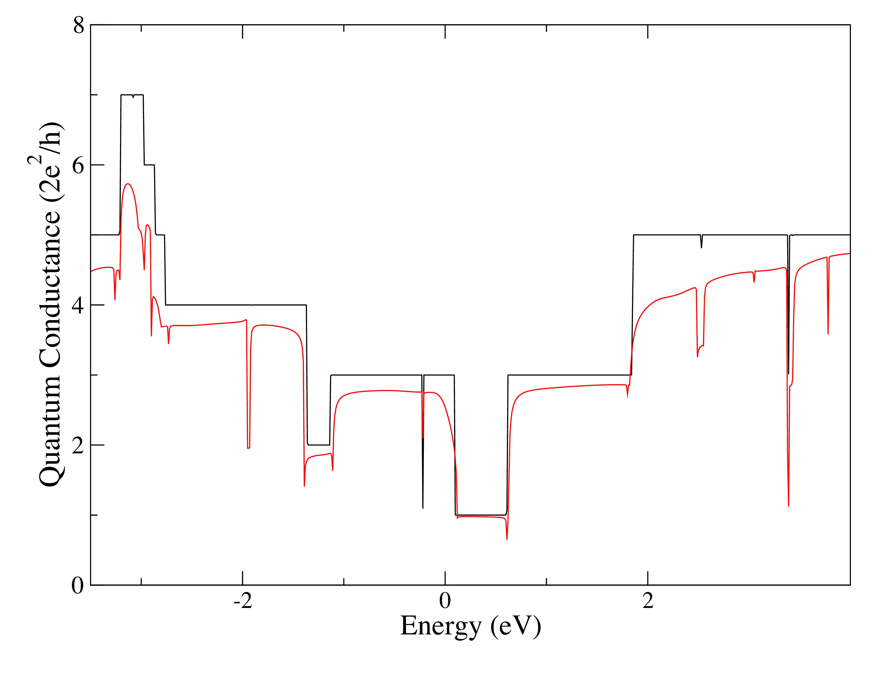

# 15: (5,0) Carbon Nanotube &#151; Transport properties {#carbon-nanotube-transport-properties-1 .unnumbered}

*Note that these systems require reasonably large-scale electronic
structure calculations.*

## Bulk Transport properties {#bulk-transport-properties .unnumbered}

-   Outline: *Obtain the quantum conductance of a pristine single-walled
    carbon nanotube*

-   Directory: `tutorials/tutorial14/periodic` *Files can be downloaded fron [here](https://github.com/wannier-developers/wannier90/tree/develop/tutorials/tutorial15)*

-   Input Files

    -    `cnt.scf` *The `pwscf` input file for ground state
        calculation*

    -    `cnt.nscf` *The `pwscf` input file to obtain Bloch
        states for the conduction states*

    -    `cnt.pw2wan` *Input file for `pw2wannier90`*

    -    `cnt.win` *The `wannier90` input file*

First we consider a single unit cell, with 10 k-points. With
`transport_mode = bulk` we compute the transport properties of a
pristine, infinite, periodic (5,0) carbon nanotube. Later, we will
compare the quantum conductance of this system with a defected nanotube.

1.  Run `pwscf` and `wannier90`.

2.  The quantum conductance and density of states are written to the
    files `cnt_qc.dat` and `cnt_dos.dat`, respectively.

## LCR transport properties &#151; Defected nanotube {#lcr-transport-properties-defected-nanotube .unnumbered}

-   Outline: *Use the automated LCR routine to investigate the effect of
    a single silicon atom in a infinite (5,0) carbon nanotube.*

-   Directory: `tutorials/tutorial15/defected` *Files can be downloaded from [here](https://github.com/wannier-developers/wannier90/tree/develop/tutorials/tutorial15)*

-   Input Files

    -    `cnt+si.scf` *The `pwscf` input file for ground
        state calculation*

    -    `cnt+si.nscf` *The `pwscf` input file to obtain
        Bloch states for the conduction states*

    -    `cnt+si.pw2wan` *Input file for `pw2wannier90`*

    -    `cnt+si.win` *The `wannier90` input file*

In this calculation an 11-atom supercell is used with a single silicon
substitutional defect in the central unit cell. The supercell is chosen
so that is conforms to the 2c2 geometry (see User Guide for details)
with principal layers set to be two unit cells long.

1.  Run `pwscf` and `wannier90`. Again these are large
    calculations, progress can be monitored by viewing respective output
    files.

2.  The quantum conductance is written to `cnt+si_qc.dat`. Compare the
    quantum conductance with the periodic (bulk) calculation. Your plot
    should look like [this](#fig:cnt_qc){reference-type="ref"
    reference="fig:cnt_qc"}.

    <figure markdown="span">
    { width="500" }
    <figure id="fig:cnt_qc">
    <figcaption> Quantum conductance of infinite pristine nanotube (black)
    compared to that of the infinite nanotube with the substitutional
    silicon defect (red).</figcaption>
    </figure>

## Further ideas {#further-ideas-3 .unnumbered}

-   Set `write_hr = true` in the bulk case. Consider the magnitude of
    Hamiltonian elements between Wannier functions in increasingly
    distant unit cells. Are two unit cell principal layers really large
    enough, or are significant errors introduced?

-   Does one unit cell either side of the defected unit cell shield the
    disorder so that the leads are ideal? Does the quantum conductance
    change if these 'buffer' regions are increased?

