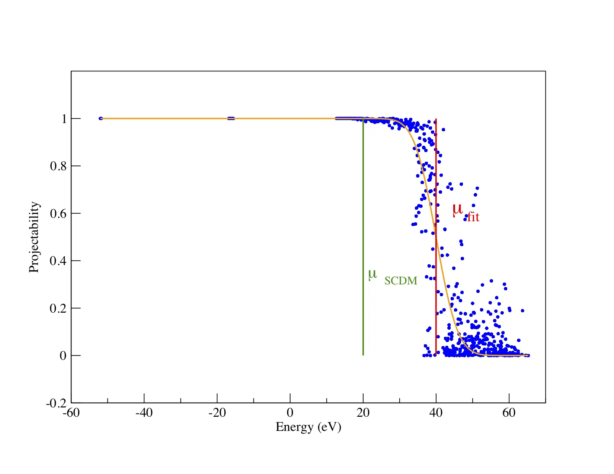

# 32: Tungsten &#151; SCDM parameters from projectability {#tungsten-scdm-parameters-from-projectability .unnumbered}

-   Outline: Compute the Wannier interpolated band structure of
    tungsten (W) using the SCDM method to calculate the initial guess
    (see Tutorial [27](tutorial_27.md) for more details). The free parameters in the SCDM
    method, i.e., $\mu$ and $\sigma$, are obtained by fitting a
    complementary error function to the projectabilities. The number of
    MLWFs is given by the number of pseudo-atomic orbitals (PAOs) in the
    pseudopotential, $21$ in this case. All the steps shown in this
    tutorial have been automated in the AiiDA[@Pizzi_AiiDA] workflow that
    can be downloaded from the MaterialsCloud
    website[@MaterialsCloudArchiveEntry].

-   Directory: `tutorials/tutorial32/` *Files can be downloaded from [here](https://github.com/wannier-developers/wannier90/tree/develop/tutorials/tutorial32)*

-   Input files

    -    `W.scf` *The `pwscf` input file for ground state
        calculation*

    -    `W.nscf` *The `pwscf` input file to obtain Bloch
        states on a uniform grid*

    -    `W.pw2wan` *The input file for `pw2wannier90`*

    -    `W.proj` *The input file for `projwfc`*

    -    `generate_weights.sh` *The bash script to extract the
        projectabilities from the output of `projwfc`*

    -    `W.win` *The `wannier90` input file*

&nbsp;

1.  Run `pwscf` to obtain the ground state of tungsten

    ```bash title="Terminal"
    pw.x -in W.scf > scf.out
    ```

2.  Run `pwscf` to obtain the Bloch states on a
    $10\times10\times10$ uniform $k$-point grid

    ```bash title="Terminal"
    pw.x -in W.nscf > nscf.out
    ```

3.  Run `wannier90` to generate a list of the required overlaps (written
    into the `W.nnkp` file)

    ```bash title="Terminal"
    wannier90.x -pp W
    ```

4.  Run `projwfc` to compute the projectabilities of the Bloch states
    onto the Bloch sums obtained from the PAOs in the pseudopotential

    ```bash title="Terminal"
    projwfc.x -in W.proj > proj.out
    ```

5.  Run `generate_weights` to extract the projectabilitites from
    `proj.out` in a format suitable to be read by Xmgrace or gnuplot

    ```bash title="Terminal"
    ./generate_weights.sh
    ```

6.  Plot the projectabilities and fit the data with the complementary
    error function

    $$
    f(\epsilon;\mu,\sigma) = \frac{1}{2}\mathrm{erfc}(-\frac{\mu - \epsilon}{\sigma}).
    $$

    We are going to use Xmgrace to plot the projectabilities and perform the fitting. Open Xmgrace

    ```bash title="Terminal"
    xmgrace
    ```

    To Import the `p_vs_e.dat` file, click on `Data` from the top bar
    and then `Import -> ASCII...`. At this point a new window
    `Grace: Read sets` should pop up. Select `p_vs_e.dat` in the `Files`
    section, click `Ok` at the bottom and close the window. You should
    now be able to see a quite noisy function that is bounded between 1
    and 0. You can modify the appearence of the plot by clicking on
    `Plot` in the top bar and then `Set appearance...`. In the `Main`
    section of the pop-up window change the symbol type from `None` to
    `Circle`. Change the line type from straight to none, since the
    lines added by default by Xmgrace are not meaningful. For the
    fitting, go to
    `Data -> Transformations -> Non-linear curve fitting`. In this
    window, select the source from the `Set` box and in the `Formula`
    box insert the following `y = 0.5 * erfc( ( x - A0 ) / A1 )` 
    Select 2 as number of parameters, give 40 as initial condition for
    `A0` and 7 for `A1`. Click `Apply`. A new window should pop up with
    the stats of the fitting. In particular you should find a
    `Correlation coefficient` of 0.96 and a value of $39.9756$ for `A0`
    and $6.6529$ for `A1`. These are the value of $\mu_{fit}$ and
    $\sigma_{fit}$ we are going to use for the SCDM method. In
    particular, $\mu_{SCDM} = \mu_{fit} - 3\sigma_{fit} = 20.0169$ eV
    and $\sigma_{SCDM} = \sigma_{fit} = 6.6529$ eV. The motivation for
    this specific choice of $\mu_{fit}$ and $\sigma_{fit}$ may be found
    in Ref. [@Vitale2019automated], where the authors also show
    validation of this approach on a dataset of 200 materials. You
    should now see the fitting function, as well as the
    projectabilities, in the graph [below](#fig:W_fit){reference-type="ref" reference="fig:W_fit"}.
    <figure markdown="span" id="fig:W_fit">
    { width="500"}
    <figcaption> Each blue dot represents the projectability as defined
    in Eq. (22) of Ref. <span class="citation" data-cites="Vitale2019automated"></span> [@Vitale2019automated] of the state |<em>n</em><strong>k</strong>⟩ as a function of the corresponding energy <em>ϵ</em><sub><em>n</em><strong>k</strong></sub>
    for tungsten. The yellow line shows the fitted complementary error
    function. The vertical red line represents the value of <em>σ</em><sub><em>f</em><em>i</em><em>t</em></sub> while the vertical green line represents the optimal value of <em>μ</em><sub><em>S</em><em>C</em><em>D</em><em>M</em></sub>,
    i.e. <em>μ</em><sub><em>S</em><em>C</em><em>D</em><em>M</em></sub> = <em>μ</em><sub><em>f</em><em>i</em><em>t</em></sub> − 3<em>σ</em><sub><em>f</em><em>i</em><em>t</em></sub>.</figcaption>
    </figure>

7.  Open `W.pw2wan` and append the following lines

    ```vi title="Input file"
    scdm_entanglement = erfc

    scdm_mu = 20.0169

    scdm_proj = .true.

    scdm_sigma = 6.6529 
    ```

8.  Run `pw2wannier90` to compute the overlaps between Bloch states and
    the projections for the starting guess (written in the `W.mmn` and
    `W.amn` files)

    ```bash title="Terminal"
    pw2wannier90.x -in W.pw2wan > pw2wan.out
    ```

9.  Run `wannier90` to obtain the interpolated bandstructure (see the band structure [plot](#fig:W_bs){reference-type="ref" reference="fig:W_bs"}).
    ```bash title="Terminal"
    wannier90.x W
    ```

    Please cite Ref. [@Vitale2019automated] in any publication employing
    the procedure outlined in this tutorial to obtain $\mu$ and $\sigma$.

<figure markdown="span" id="fig:W_bs">
{ width="500"}
<figcaption> Band structure of tungsten on the <em>Γ</em>-H-N-<em>Γ</em> path from DFT calculations (solid black) and Wannier interpolation using the SCDM method to construct the
initial guess (red dots).</figcaption>
</figure>
